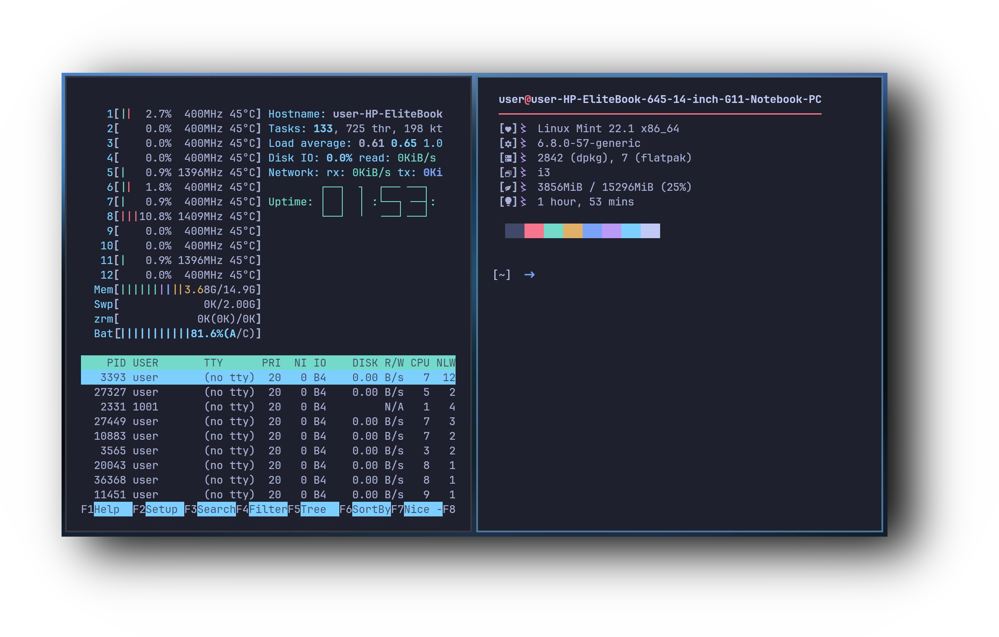

<div align="center">

# i3 Dotfiles
### A custom configured setup 


This repository contains my personalized dotfiles setup for the i3 window manager, along with configurations for the Kitty terminal and some additional resources like fonts and a background image. Below is an overview of the structure and purpose of each file and directory.





This repository contains my personalized dotfiles setup for the i3 window manager, along with configurations for the Kitty terminal and some additional resources like fonts and a background image. Below is an overview of the structure and purpose of each file and directory.

## Repository Structure

```
.
├── background
│   └── 1746370510628552.jpg         # Background image for desktop wallpaper.
├── config
│   ├── i3
│   │   └── config                   # i3 window manager configuration file.
│   └── kitty
│       ├── colors.ini               # Kitty terminal color scheme.
│       └── kitty.conf               # Main configuration file for Kitty terminal.
└── fonts
    └── JetBrainsMonoNerdFontMono-Regular.ttf  # Nerd Font for enhanced icons in terminals and editors.
```

## Features

### i3 Window Manager

* Customized keybindings and layouts for efficient navigation.
* Simplified and minimalistic configuration for better performance.

### Kitty Terminal

* Custom color scheme for a cohesive look.
* Tweaked settings for better usability and aesthetics.

### Fonts

* [JetBrains Mono Nerd Font](https://www.nerdfonts.com/) included to enable enhanced icon support in terminal and code editors.

### Background

* A high-quality wallpaper to complement the minimalistic setup.

## Installation

### Clone the Repository

```bash
git clone https://github.com/user7210unix/i3-dots.git
cd i3-dots
```

### Set Up Configurations

1. **i3 Configuration**:
   Copy the i3 config file to your i3 configuration directory:

   ```bash
   mkdir -p ~/.config/i3
   cp config/i3/config ~/.config/i3/
   ```

2. **Kitty Configuration**:
   Copy the Kitty config files to your Kitty configuration directory:

   ```bash
   mkdir -p ~/.config/kitty
   cp config/kitty/* ~/.config/kitty/
   ```

3. **Font Installation**:
   Install the Nerd Font:

   ```bash
   mkdir -p ~/.local/share/fonts
   cp fonts/JetBrainsMonoNerdFontMono-Regular.ttf ~/.local/share/fonts/
   fc-cache -fv
   ```

4. **Background**:
   Set the included wallpaper as your desktop background using your preferred method (e.g., `feh`, `nitrogen`, etc.).
   Example with `feh`:

   ```bash
   feh --bg-scale background/1746370510628552.jpg
   ```

## Contributing

Feel free to open issues or submit pull requests to suggest improvements or additional features.

## License

This repository is licensed under the [MIT License](LICENSE).

